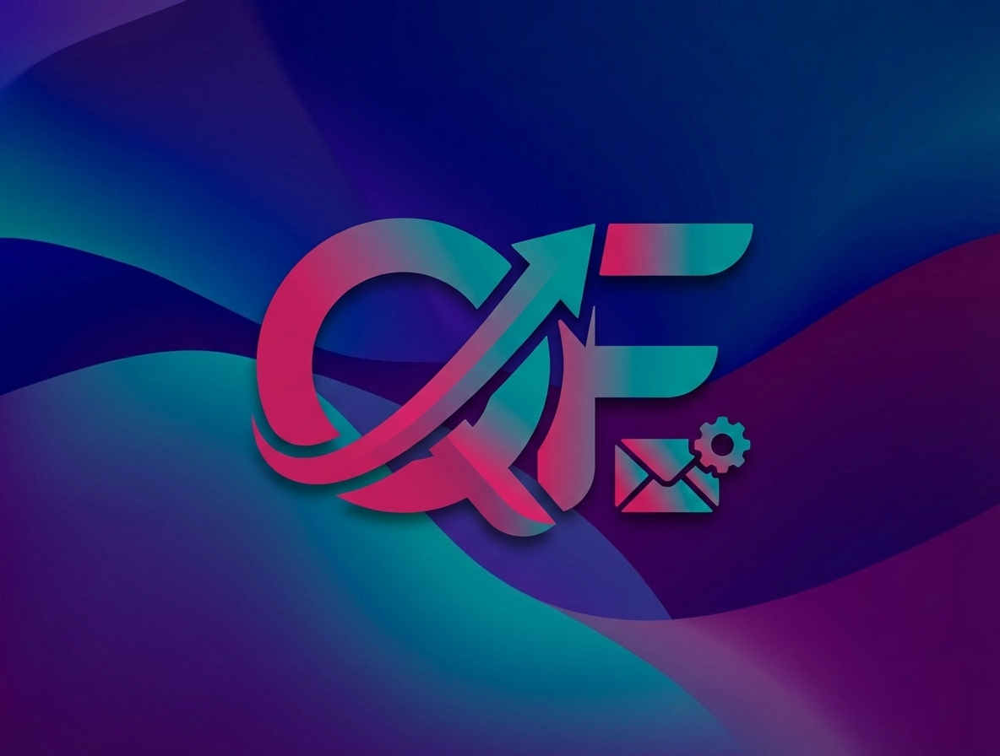

# QuickFlow

> **Intelligent Meetings, Effortless Emails.**
> Transform your workflow with AI-powered meeting summaries, structured minutes, and instant email drafting.

<!-- Placeholder image for now, user can replace later -->

## Overview

**QuickFlow** is a modern productivity suite designed to act as your personal executive assistant. Leveraging local LLMs and a premium "Dark Nebula" aesthetic, it streamlines your daily communication tasks while keeping your data private.

## ✨ Features

### 📝 AI Meeting Minutes
- **Structured Mode**: Fill in meeting details (attendees, agenda, decisions) and generate formal minutes (PV).
- **Quick Mode**: Paste rough notes and let AI extract the structure automatically.
- **Template System**: Save and reuse meeting structures for recurring syncs.
- **PDF Generation**: Export professional PDF reports in one click.

### ✉️ AI Email Writer
- **Smart Drafting**: Describe your intent ("ask for a budget increase") and get a polished email.
- **Tone Adjustment**: Switch between Formal, Casual, or Urgent tones instantly.
- **Direct Sending**: Integrated with Gmail and Outlook for seamless delivery.

## 🛠️ Tech Stack

Built with cutting-edge technologies for performance and experience:

- **Frontend**: [React 18](https://react.dev/), [TypeScript](https://www.typescriptlang.org/), [Vite](https://vitejs.dev/), [Tailwind CSS](https://tailwindcss.com/), [Framer Motion](https://www.framer.com/motion/)
- **Backend**: [Spring Boot 3.3](https://spring.io/projects/spring-boot), [Spring AI](https://spring.io/projects/spring-ai)
- **Database**: [MongoDB](https://www.mongodb.com/)
- **AI Engine**: [Ollama](https://ollama.ai/) (Local Mistral-Nemo model)
- **Auth**: [Supabase](https://supabase.com/)

## 🚀 Getting Started

QuickFlow is designed to be easy to set up.

👉 **[Click here for the Setup Guide](./SETUP.md)**

## 🗺️ Roadmap

We are constantly improving QuickFlow. Here's what's coming next:
- [ ] **Autocomplete**: Smart suggestions for participants and agenda items.
- [ ] **Calendar Integration**: Sync meetings directly from Google/Outlook Calendar.
- [ ] **Voice Mode**: Real-time transcription and summarization.
- [ ] **Team Workspaces**: Share templates and minutes with your team.

## License

[MIT](./LICENSE)
