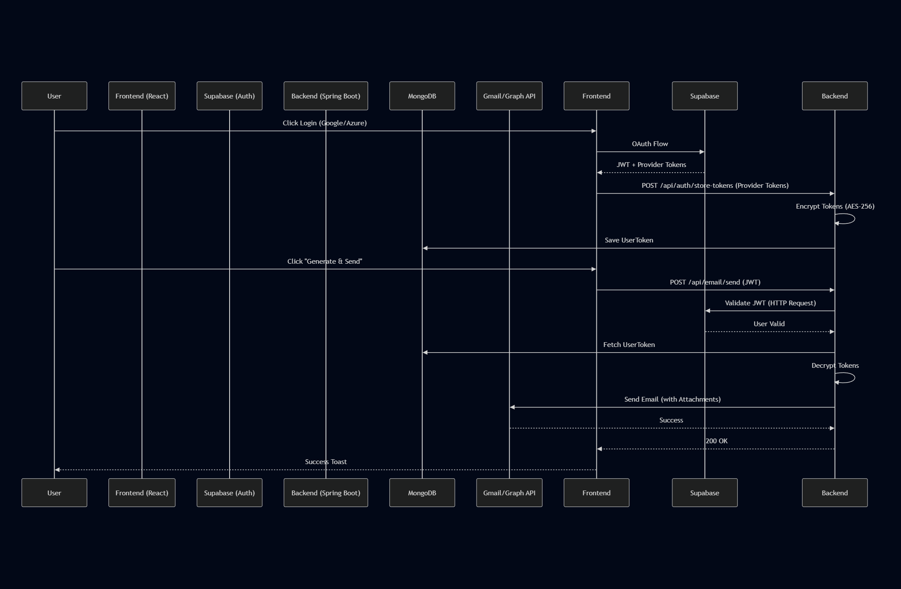

# Technical Architecture & Security Audit Report

## 1) Full App Dataflow

### System Architecture
The application follows a **Modern Single-Page Application (SPA)** architecture with a decoupled backend.

**Frontend (React + Vite)** `<-->` **Backend (Spring Boot)** `<-->` **Database (MongoDB)**

### End-to-End Dataflow
1.  **Authentication (Supabase)**:
    *   User logs in on Frontend via Supabase (Google/Azure/Email).
    *   Supabase returns a **JWT (Access Token)** and **Refresh Token** to the Frontend.
    *   Frontend stores tokens (AuthContext).
    *   Frontend intercepts all API requests to add header: `Authorization: Bearer <JWT>`.

2.  **API Requests (Backend)**:
    *   Spring Security (`SupabaseJwtFilter`) intercepts the request.
    *   **Validation**: Backend calls Supabase API (`/auth/v1/user`) to validate the JWT for *every request* (Performance Bottleneck).
    *   If valid, SecurityContext is set with User ID.

3.  **Email Sending Flow** (Complex State):
    *   **Token Storage**: After OAuth login, Frontend calls `/api/auth/store-tokens` with the provider's Access/Refresh tokens.
    *   **Encryption**: Backend accepts these tokens, encrypts them (AES-256-GCM), and saves them to MongoDB (`UserToken` collection).
    *   **Sending**: When User requests "Send Email":
        1.  Backend retrieves encrypted tokens from MongoDB.
        2.  Decrypts tokens.
        3.  Uses Google/Microsoft Graph SDKs to send email on behalf of the user.

### Visual Dataflow

---

## 2) Feature Breakdown

| Feature | Code Path | Description | Dependencies | Risks |
| :--- | :--- | :--- | :--- | :--- |
| **Auth** | `Config/SecurityConfig.java` `frontend/src/lib/auth` | Supabase-based auth. Frontend handles login, Backend validates via API. | Supabase API | API Latency on validation. |
| **Token Storage** | `Controllers/AuthController.java` `Services/TokenStorageService.java` | Stores OAuth access/refresh tokens for offline access (sending emails). | MongoDB, AES Encryption | **High**. Frontend sends refresh tokens. |
| **AI Generation** | `Services/LLMService.java` | Generates meeting minutes/emails using Spring AI (Ollama). | Ollama (Local) | Local model dependency. |
| **Email Sending** | `Services/EmailProviderService.java` `Services/GmailService.java` | Sends emails via Gmail/Outlook APIs using stored tokens. | Google/Graph APIs | Token expiry handling. |
| **PDF Generation** | `Services/PdfService.java` | Converts HTML content to PDF for attachments. | iText 7 + html2pdf | Memory usage on large docs. |
| **Meeting Gen** | `Controllers/MeetingController.java` | API endpoint to trigger AI generation from form data. | LLMService | Long running requests (timeout). |

---

## 3) Technology Deep Dive

### Backend
*   **Spring Boot 3.3.0**: Core framework. Defines structure, dependency injection, and web server (Tomcat).
    *   *Docs*: [Spring Boot](https://spring.io/projects/spring-boot)
*   **Spring Security + Auth0 JWT**: Handles protection of API endpoints. Specifically configured for stateless JWT validation.
    *   *Docs*: [Spring Security](https://spring.io/projects/spring-security)
*   **Spring AI (Ollama)**: Integration with local LLMs. Allows Java code to "chat" with the model.
    *   *Docs*: [Spring AI](https://docs.spring.io/spring-ai/reference/)
*   **MongoDB**: Document store. Used to save encryption tokens (schema-less flexibility is good for varying provider metadata).
    *   *Docs*: [Spring Data MongoDB](https://spring.io/projects/spring-data-mongodb)

### Frontend
*   **React 18 + Vite**: Modern, fast-build frontend.
    *   *Docs*: [Vite](https://vitejs.dev/guide/)
*   **Tailwind CSS**: Utility-first CSS for styling. Used for the specialized "Neon" theme.
    *   *Docs*: [Tailwind CSS](https://tailwindcss.com/)
*   **Supabase (Auth)**: Backend-as-a-Service for Authentication. Simplifies user management.
    *   *Docs*: [Supabase Auth](https://supabase.com/docs/guides/auth)
*   **Axios**: HTTP Client. Used instead of fetch for better interceptor support (adding Auth headers).

---

## 4) Codebase Analysis & Cleanliness Report

### Issues Found
*   **Excessive Logging**: The codebase is littered with `System.out.println` and `System.err.println`.
    *   *Fix*: Replace with SLJ4J (`Logger`).
*   **Weak Typing in Controllers**: Controllers use `Map<String, Object>` for Request Bodies instead of proper DTO Classes (Data Transfer Objects).
    *   *Impact*: Hard to validate inputs, no compile-time safety.
*   **Hardcoded Configuration**:
    *   Supabase Keys are hardcoded in `SupabaseJwtFilter.java`.
    *   Supabase URL is hardcoded in `frontend/src/lib/supabase.ts`.
    *   *Cleanliness*: Poor separation of concerns.
*   **Performance Bottleneck**: `SupabaseJwtFilter` makes a synchronous network call to Supabase for *every* API request.
    *   *Refactor*: Use a JWT decoder library to verify the signature locally using the Supabase JWT Secret, instead of calling the API.

---

## 5) Security Audit (High Priority)

### Critical Vulnerabilities [SEVERITY: CRITICAL-HIGH]

1.  **Secrets Exposed in Code (Critical)**
    *   **File**: `backend/.../Config/SupabaseJwtFilter.java` (Line 38)
    *   **File**: `frontend/src/lib/supabase.ts` (Line 10)
    *   **Issue**: Supabase Anon Key and potentially other defaults are hardcoded.
    *   **Fix**: Move ALL secrets to Environment Variables (`.env` file). Never commit keys.

2.  **Default Encryption Key Logic (High)**
    *   **File**: `backend/.../Services/EncryptionService.java` (Line 31)
    *   **Issue**: Falls back to `"QuickFlowDev32ByteEncryptionKey!"` if env var is missing.
    *   **Risk**: If deployed without config, data is encrypted with a known key.
    *   **Fix**: Throw internal error if key is missing. Do not fallback to default in typical reuse.

3.  **Frontend Sending Refresh Tokens (High)**
    *   **File**: `frontend/src/lib/api.ts` -> `storeOAuthTokens`
    *   **Issue**: The frontend sends the sensitive Refresh Token (which grants long-term access) to the backend.
    *   **Risk**: If an attacker intercepts this request (XSS), they steal the user's permanent Google/Outlook access.
    *   **Fix**: Ideally, perform the OAuth Code Exchange on the *Backend* so the Refresh Token never touches the browser.

### Medium Vulnerabilities

4.  **No Rate Limiting**
    *   **Issue**: Endpoints like `/api/email/send` trigger heavy operations (AI + Email + PDF).
    *   **Risk**: DOS attack could exhaust API quotas or server memory.
    *   **Fix**: Implement Bucket4j or similar rate limiting on generic API routes.

5.  **Verbose Error Messages**
    *   **File**: `Controllers/AuthController.java` (Line 109)
    *   **Issue**: Returns `e.getMessage()` directly to client.
    *   **Risk**: Information Leaks (Stack traces, internal paths).

---

## 6) Action Plan

### Tier 1: Immediate Security Fixes (1-2 Hours)
1.  **Remove Hardcoded Keys**: Replace all `@Value` string defaults in Java and literal strings in TS with true Env Var references.
2.  **Secure Encryption Service**: Remove the default fallback key in `EncryptionService`. Force failure if key is missing.
3.  **Sanitize Logs**: Remove `System.out.println` printing token values or sensitive user info.

### Tier 2: Architecture Refactors (1-2 Days)
1.  **Introduce DTOs**: Replace `Map<String, Object>` in Controllers with `LoginRequest`, `EmailRequest` Java classes/records.
2.  **Optimize Auth**: Change `SupabaseJwtFilter` to verify the JWT signature *locally* (using the Project Secret) instead of calling the Supabase API. This will reduce latency by ~200ms per request.

### Tier 3: Long Term (1-2 Weeks)
1.  **Backend OAuth Flow**: Move the Google/Microsoft OAuth flow entirely to the backend. The Frontend should only pass an "Auth Code", and the Backend calls the provider to exchange it for Tokens. This keeps Refresh Tokens off the client.
2.  **Logging Infrastucture**: Implement SLF4J + Logback properly.
