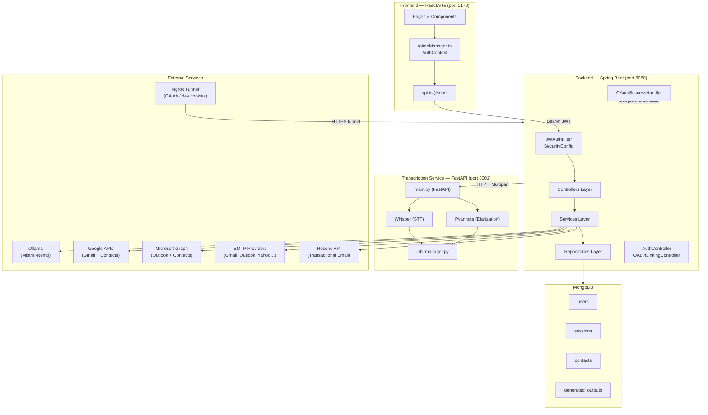

# QuickFlow: Deep Technical Audit Report

## 1. Project Architecture Overview

QuickFlow implements a modern multi-service architecture designed for secure, AI-powered document generation and email automation.



- **Frontend**: A responsive Single Page Application (SPA) built with React 18, delivering a "Dark Nebula" UI theme.
- **Backend**: A RESTful Spring Boot 3.3 API handling all business logic, auth, AI integration, and database access.
- **Database**: MongoDB for flexible, document-oriented data storage (users, sessions, contacts, history).
- **AI Layer**: Local LLM inference via Ollama (Mistral-Nemo) for privacy-preserving content generation.
- **Authentication**: Self-hosted Spring Security + JWT system — email/password and OAuth2 (Google, Microsoft).
- **Email**: Gmail API, Microsoft Graph API, and direct SMTP for users without OAuth.
- **Transcription Service**: Dedicated Python microservice using OpenAI Whisper and Pyannote.
- **Tunnel**: Ngrok provides a stable HTTPS domain for OAuth callback and cross-origin cookie support in development.

---

## 2. Backend Analysis (`com.ai.application`)

The backend is a layered Spring Boot application following Controller → Service → Repository conventions.

### 2.1 Core Application
- **`AiApplication.java`**: Entry point — bootstraps Servlet container and Spring Context.

### 2.2 Controllers (API Layer)

REST endpoints that handle HTTP requests and responses.

| Controller | Base Path | Responsibility |
|---|---|---|
| `AuthController` | `/api/auth` | Signup, login, logout, token refresh, MFA, password reset, email verification |
| `OAuthLinkingController` | `/api/auth` | OAuth account linking flow (link Google/Microsoft to an existing account for email sending) |
| `SmtpConfigController` | `/api/user/smtp` | SMTP configuration, status, test, and removal for non-OAuth users |
| `ContactController` | `/api/contacts` | Contact CRUD, Google/Microsoft people sync, search, autocomplete |
| `EmailController` | `/api/email` | AI email drafting and final send via linked provider |
| `VoiceModeController` | `/api/minutes/voice` | Audio upload, transcription polling, minute generation from transcript |
| `QuickModeController` | `/api/minutes/quick` | Unstructured text → structured minute extraction |
| `StructuredModeController` | `/api/minutes/structured` | Structured form submission → minute generation |
| `MinutesEmailController` | `/api/minutes` | Send generated minutes as email with PDF |
| `MeetingController` | `/api/meeting` | Legacy meeting CRUD (kept for backward compatibility) |
| `MeetingTemplateController` | `/api/meeting-templates` | User-defined meeting template CRUD |
| `PdfController` | `/api/pdf` | PDF generation, preview streaming, download |
| `BookmarkController` | `/api/bookmarks` | User bookmarks |
| `GroupController` | `/api/groups` | Contact groups — CRUD, membership management |
| `HistoryController` | `/api/history` | User-specific generated content history |
| `SupportController` | `/api/support` | Tech support email submission |
| `HealthController` | `/api` | Liveness probe (`/api/health`) |

### 2.3 Services (Business Logic)

| Service | Responsibility |
|---|---|
| `AuthService` | User registration, login, password hashing, token generation |
| `TokenService` | JWT creation and validation |
| `TokenRefreshService` | OAuth2 access token rotation for Google/Microsoft (on-demand) |
| `TokenStorageService` | Retrieve and decrypt OAuth tokens from `User.authConnections` |
| `EncryptionService` | AES-256 symmetric encryption for all sensitive data at rest |
| `EmailProviderService` | Strategy pattern — routes email sends to Gmail, Microsoft Graph, or SMTP |
| `GmailService` | Google Gmail API integration (send email via user's account) |
| `MicrosoftGraphService` | Azure/Microsoft Graph API integration (send Outlook email + contact sync) |
| `SmtpEmailService` | Direct SMTP/STARTTLS email sending using user's app-specific password |
| `ContactService` | Contact CRUD, Google/Microsoft People API sync, search, autocomplete, usage tracking |
| `GooglePeopleService` | Fetches and maps contacts from Google People API |
| `QuickFlowDetectionService` | Detects if a given contact's email is a registered QuickFlow user |
| `DomainDetectionService` | DNS MX lookup to identify a user's email hosting provider (Gmail, Outlook, Yahoo…) |
| `LLMService` | Orchestrates prompts to Ollama/Spring AI; prompt engineering for minutes and emails |
| `TranscriptionService` | Communicates with the Python transcription microservice (upload → poll → parse) |
| `PdfGenerationService` | iText 7 HTML-to-PDF rendering for formal minute documents |
| `PdfService` | Low-level PDF manipulation utilities |
| `MeetingTemplateService` | Template CRUD and usage tracking |
| `TemplateService` | System-level LLM prompt template management |
| `FileProcessingService` | PDF/DOCX text extraction for Quick Mode file uploads |
| `HistoryService` | User history retrieval and deletion with data isolation |
| `DataMigrationService` | **One-time migration utility** — converts legacy `UserToken` documents into the `User.authConnections` model |

### 2.4 Repositories (Data Access)

Spring Data MongoDB repositories:

| Repository | Collection | Notes |
|---|---|---|
| `UserRepository` | `users` | Primary user identity + auth connections + SMTP config |
| `UserSessionRepository` | `sessions` | Server-side session tracking with TTL auto-expiry |
| `ContactRepository` | `contacts` | Synced contacts with search, favorites, usage tracking |
| `GeneratedOutputRepository` | `generated_outputs` | History of AI-generated minutes and emails |
| `MeetingRepository` | `meetings` | Meeting records |
| `MeetingTemplateRepository` | `meeting_templates` | User-defined meeting templates |
| `EmailRepository` | `emails` | Email send logs/metadata |
| `TemplateRepository` | `templates` | System prompt templates |
| `UserTokenRepository` | `user_tokens` | **Legacy only** — used exclusively by `DataMigrationService` for one-time migration of old data |

### 2.5 Security & Configuration

| Component | Role |
|---|---|
| `JwtAuthFilter` | Servlet filter — extracts and validates the `Authorization: Bearer <JWT>` header on every request |
| `SecurityConfig` | Spring Security configuration — defines public vs. protected endpoints, CORS, OAuth2 login |
| `OAuthSuccessHandler` | Handles Google/Microsoft OAuth2 login callback — creates/finds user, stores encrypted tokens in `AuthConnection`, issues JWT |
| `RateLimitFilter` | In-memory per-IP rate limiter (configurable per endpoint) |
| `SecurityHeadersFilter` | Adds security headers to all responses (X-Frame-Options, X-Content-Type-Options, etc.) |
| `WebConfig` | Global CORS configuration (`app.frontend.url`) |
| `SmtpProviderConfig` | Static configuration of known SMTP providers and their host/port/TLS settings |

### 2.6 Data Models

#### `User` (MongoDB: `users`)
Primary identity model:

| Field | Type | Description |
|---|---|---|
| `id` | String | MongoDB ObjectId |
| `email` | String (unique) | User's email address |
| `name` | String | Display name |
| `role` | Enum | `USER`, `ADMIN` |
| `passwordHash` | String | bcrypt hash (null for OAuth-only users) |
| `emailVerified` | boolean | Email verification status |
| `authConnections` | `List<AuthConnection>` | Embedded OAuth connections (Google, Microsoft) |
| `smtpPasswordEncrypted` | String | AES-256 encrypted SMTP app password |
| `smtpConfigured` | boolean | Whether SMTP is configured |
| `hostingProvider` | String | Detected email hosting provider (dns MX lookup) |
| `mfaEnabled` | boolean | MFA toggle |
| `mfaSecretEncrypted` | String | AES-256 encrypted TOTP secret |
| `plan` | String | Subscription plan |
| `trialExpiresAt` | Date | Trial expiry timestamp |

#### `AuthConnection` (embedded in `User`)
One OAuth provider connection per entry:

| Field | Description |
|---|---|
| `provider` | `"google"` or `"microsoft"` |
| `connectionType` | `"primary"` (signed up via OAuth) or `"linked"` (linked later) |
| `accessTokenEncrypted` | AES-256 encrypted OAuth access token |
| `refreshTokenEncrypted` | AES-256 encrypted OAuth refresh token |
| `providerEmail` | Email from the OAuth provider |
| `grantedScopes` | Comma-separated list of authorized scopes |
| `connectedAt` | Timestamp |

#### `UserSession` (MongoDB: `sessions`)
Server-side refresh token tracking:

| Field | Description |
|---|---|
| `userId` | Reference to `User.id` |
| `refreshTokenHash` | bcrypt hash of the refresh token |
| `deviceInfo` | User-Agent string |
| `ipAddress` | Client IP |
| `createdAt` | TTL-indexed for automatic expiry |

---

### 2.7 API Endpoints

#### Authentication (`/api/auth`)

| Method | Endpoint | Auth | Description |
|---|---|---|---|
| `POST` | `/signup` | Public | Create account (email + password) |
| `POST` | `/login` | Public | Login — returns JWT + refresh cookie |
| `POST` | `/verify-mfa` | Public | Complete TOTP MFA challenge |
| `POST` | `/refresh` | Public (cookie) | Rotate access token using httpOnly refresh cookie |
| `POST` | `/forgot-password` | Public | Send password reset email |
| `POST` | `/reset-password` | Public | Apply password reset token |
| `POST` | `/verify-email` | Public | Verify email from link |
| `POST` | `/send-verification` | Public | Resend verification email |
| `POST` | `/logout` | JWT | Invalidate session + clear cookie |
| `GET` | `/me` | JWT | Get current user profile |
| `GET` | `/providers` | JWT | List connected OAuth providers |
| `GET` | `/sessions` | JWT | List all active sessions |
| `DELETE` | `/sessions/{id}` | JWT | Revoke a specific session |
| `GET` | `/link/{provider}` | JWT | Get OAuth authorization URL for linking (provider = `google` or `microsoft`) |
| `GET` | `/link/callback` | OAuth redirect | OAuth callback for account linking — stores tokens in `AuthConnection` |
| `DELETE` | `/link` | JWT | Unlink all OAuth-linked providers |
| `GET` | `/email-capability` | JWT | Check if user can send email (has OAuth or SMTP configured) |
| `POST` | `/store-tokens` | JWT | No-op stub — kept for backward compatibility |

#### SMTP Configuration (`/api/user/smtp`)

| Method | Endpoint | Auth | Description |
|---|---|---|---|
| `POST` | `/configure` | JWT | Validate and store encrypted SMTP app password |
| `GET` | `/status` | JWT | Get SMTP config status + hosting provider detection |
| `POST` | `/test` | JWT | Send a test email to verify SMTP config |
| `DELETE` | `/config` | JWT | Remove SMTP configuration |
| `POST` | `/skip` | JWT | Mark SMTP setup as skipped |

#### Meeting Minutes (`/api/minutes`)

| Method | Endpoint | Auth | Description |
|---|---|---|---|
| `POST` | `/quick/extract` | JWT | Quick Mode: extract structured data from raw text |
| `POST` | `/quick/extract-file` | JWT | Quick Mode: extract from uploaded PDF/DOCX |
| `POST` | `/quick/generate` | JWT | Quick Mode: generate minutes from extracted data |
| `POST` | `/structured/generate` | JWT | Structured Mode: generate minutes from detailed form |
| `POST` | `/send` | JWT | Send minutes as email with PDF attachment |
| `POST` | `/voice/transcribe` | JWT | Upload audio file — returns `jobId` immediately |
| `GET` | `/voice/status` | JWT | Check if transcription service is available |
| `GET` | `/voice/progress/{jobId}` | JWT | Poll transcription job progress (0–100%) |
| `GET` | `/voice/job/{jobId}` | JWT | Get final transcription job status and result |
| `POST` | `/voice/cancel/{jobId}` | JWT | Cancel a running transcription job |
| `POST` | `/voice/generate` | JWT | Generate minutes from a completed transcript |

#### Contacts (`/api/contacts`)

| Method | Endpoint | Auth | Description |
|---|---|---|---|
| `GET` | `/` | JWT | List all contacts (with filter/source/sortBy params) |
| `GET` | `/search` | JWT | Search contacts for autocomplete (`?q=&limit=`) |
| `GET` | `/recent` | JWT | Get recently used contacts (`?limit=`) |
| `POST` | `/sync` | JWT | Sync contacts from Google or Microsoft |
| `GET` | `/sync/status` | JWT | Get sync status and last sync timestamp |
| `POST` | `/{id}/usage` | JWT | Increment usage counter |
| `PUT` | `/{id}/favorite` | JWT | Toggle favorite status |

#### Email (`/api/email`)

| Method | Endpoint | Auth | Description |
|---|---|---|---|
| `POST` | `/send` | JWT | Generate AI email draft |
| `POST` | `/send-final` | JWT | Send finalized email via Gmail/Outlook/SMTP |

#### Meeting Templates (`/api/meeting-templates`)

| Method | Endpoint | Auth | Description |
|---|---|---|---|
| `POST` | `/` | JWT | Create a new template |
| `GET` | `/` | JWT | List all templates for the user |
| `GET` | `/{id}` | JWT | Get a specific template |
| `PUT` | `/{id}` | JWT | Update a template |
| `DELETE` | `/{id}` | JWT | Delete a template |
| `POST` | `/{id}/track-usage` | JWT | Increment usage counter |

#### PDF (`/api/pdf`)

| Method | Endpoint | Auth | Description |
|---|---|---|---|
| `POST` | `/generate` | JWT | Generate PDF from HTML content |
| `GET` | `/preview/{id}` | JWT | Stream PDF inline for browser preview |
| `GET` | `/download/{id}` | JWT | Download PDF as attachment |

#### Other

| Method | Endpoint | Auth | Description |
|---|---|---|---|
| `GET` | `/api/health` | Public | Liveness probe |
| `GET/POST/DELETE` | `/api/bookmarks/**` | JWT | Bookmark management |
| `GET/POST/PUT/DELETE` | `/api/groups/**` | JWT | Contact group management |
| `GET/DELETE` | `/api/history/**` | JWT | Generated content history |
| `POST` | `/api/support/report/send` | JWT | Submit tech support email |

---

### 2.8 Python Transcription Service (`transcription-service`)

A dedicated microservice optimized for GPU-accelerated audio processing, running independently on port **8001**.

#### Core Components

| File | Role |
|---|---|
| `main.py` | FastAPI application — defines all REST endpoints |
| `transcription.py` | Wraps `openai-whisper` for speech-to-text. Handles model loading and VRAM management |
| `diarization.py` | Wraps `pyannote.audio` for speaker identification — segments audio by speaker turns |
| `job_manager.py` | Async job queue using `asyncio.Semaphore` — manages job lifecycle (Queued → Processing → Completed/Failed/Cancelled) |
| `health.py` | Builds health check response (model loaded status, GPU info) |
| `config.py` | Configuration via environment variables (`SERVICE_PORT=8001`, `WHISPER_MODEL`, `WHISPER_DEVICE`, etc.) |
| `metrics.py` | Prometheus metrics exposition (`/metrics` endpoint) |

#### Transcription Service Endpoints

| Method | Endpoint | Description |
|---|---|---|
| `GET` | `/health` | Returns model load status and GPU info |
| `POST` | `/transcribe` | Upload audio → returns `jobId` immediately |
| `GET` | `/progress/{jobId}` | Poll progress (0–100%, current stage) |
| `GET` | `/status/{jobId}` | Detailed job status |
| `GET` | `/result/{jobId}` | Get final result (segments, speakers, full_text) |
| `POST` | `/cancel/{jobId}` | Cancel a running job |
| `GET` | `/metrics` | Prometheus metrics |

#### Architecture Notes
- **Concurrency Control**: Semaphore limits concurrent GPU jobs to `MAX_CONCURRENT_JOBS` (default: 2) to prevent OOM errors.
- **Async Processing**: Returns a `jobId` immediately; processing runs as an `asyncio` background task.
- **Hardware**: Auto-detects CUDA; falls back to CPU.
- **Audio Pipeline**: Audio is converted to 16kHz mono WAV via `ffmpeg` before diarization for stability.

---

## 3. Frontend Analysis (`frontend`)

A React 18 SPA structured for component reusability and type safety.

### 3.1 Technology Stack

| Technology | Role |
|---|---|
| **React 18** | UI library |
| **Vite** | Build tool (fast HMR, ESM bundling) |
| **TypeScript** (strict) | Type safety throughout |
| **Tailwind CSS** | Utility-first styling + custom "Nebula" theme |
| **Framer Motion** | Page transitions, hover effects, micro-animations |
| **React Context API** | Global state (`AuthContext`, `ReviewContext`) |

### 3.2 Authentication Client (`lib/`)

| File | Role |
|---|---|
| `tokenManager.ts` | In-memory token storage, silent refresh scheduling, localStorage persistence of access token |
| `authContext.tsx` | React context — exposes `user`, `login()`, `logout()`, `isAuthenticated` |
| `api.ts` | Axios instance with `Authorization: Bearer` interceptor; handles 401 responses gracefully without wiping tokens |

> **Note:** Supabase has been fully removed from the frontend. All authentication flows go directly to the Spring Boot backend.

### 3.3 Key Pages (Routes)

| Page | Route | Description |
|---|---|---|
| `AuthPage` | `/auth` | Login / Register with email+password and Google/Microsoft OAuth buttons |
| `AuthCallbackPage` | `/auth/callback` | Extracts JWT from URL after OAuth login, stores via `tokenManager` |
| `HomePage` | `/home` | Dashboard — action cards for all features |
| `ContactsPage` | `/contacts` | Contact management — sync, search, favorites, QuickFlow detection |
| `ModeSelectionPage` | `/minutes` | Choose between Quick, Structured, or Voice mode |
| `StructuredModePage` | `/minutes/structured` | Complex form with dynamic fields + template loading |
| `QuickModePage` | `/minutes/quick` | Raw note paste or file upload |
| `QuickModeReviewPage` | `/minutes/quick/review` | AI-extracted data review with contact autocomplete |
| `VoiceModePage` | `/minutes/voice` | Wizard: Upload → Transcribe → Review Transcript → Generate |
| `ContentEditorPage` | `/editor` | Rich text editor (ReactQuill) for polishing generated minutes |
| `TemplateManagementPage` | `/templates` | CRUD for meeting templates |
| `EmailPage` | `/email` | AI Email Writer with contact autocomplete |
| `HistoryPage` | `/history` | Browsable history of generated documents |
| `TechSupportPage` | `/support` | Tech support form |

### 3.4 Core Components

| Component | Description |
|---|---|
| `NebulaBackground` | Canvas-based animated star/nebula particle background |
| `RichTextEditor` | ReactQuill WYSIWYG wrapper for editing minutes |
| `ContactAutocomplete` | Smart search input with dropdown — searches synced contacts |
| `PdfPreviewModal` | Unified modal for PDF preview + email send initiation |
| `RecipientSelectionModal` | Select meeting participants as email recipients |
| `SaveTemplateModal` / `EditTemplateModal` | Template system modals |
| `UserAvatar` | Dynamic avatar with initials fallback + QuickFlow user indicator |

---

## 4. Protocols & Techniques

### 4.1 Authentication & Authorization

```
Email/Password flow:
  POST /api/auth/login → JWT (access) + httpOnly cookie (refresh)
  Every request: Authorization: Bearer <accessToken>
  Auto-refresh: tokenManager detects expiry, calls POST /api/auth/refresh

OAuth2 Login (Google / Microsoft):
  Browser → /oauth2/authorization/google → Google consent
  → /login/oauth2/code/google → OAuthSuccessHandler
  → stores tokens in User.authConnections → issues JWT
  → redirects to /auth/callback?token=<JWT>

OAuth Account Linking (email sending):
  GET /api/auth/link/google → returns authorizationUrl (with HMAC state)
  Browser → Google consent (gmail.send + contacts.readonly scopes)
  → /api/auth/link/callback → stores in User.authConnections
```

- **JWT**: HMAC-SHA256, 15 min access token, 7-day refresh token stored in bcrypt-hashed server-side sessions.
- **Ngrok**: Required in development because OAuth providers issue httpOnly cookies with `SameSite=None; Secure`, which requires HTTPS even for localhost flows.

### 4.2 Email Sending Strategy

`EmailProviderService` uses a priority chain for each user:

```
1. Google OAuth (AuthConnection "google") → GmailService
2. Microsoft OAuth (AuthConnection "microsoft") → MicrosoftGraphService
3. SMTP (user.smtpConfigured) → SmtpEmailService (STARTTLS)
4. None found → error "No email account configured"
```

Provider detection uses DNS MX record lookup (`DomainDetectionService`) to auto-identify the user's hosting provider and suggest the appropriate setup path.

### 4.3 AI & Content Generation

- **Engine**: Ollama running locally (Mistral-Nemo model, 12B parameters).
- **Pattern**: RAG-lite — meeting form data / transcript text is injected directly into the prompt as context.
- **Prompt Engineering**: `LLMService` constructs role-based prompts instructing the model to act as a "Professional Secretary", enforcing strict JSON/Markdown output formats for reliable parsing.
- **Streaming**: Not used — full response awaited before returning to client.

### 4.4 Transcription Pipeline

```
Frontend uploads audio file
→ POST /api/minutes/voice/transcribe (Spring Boot)
→ forwards to POST http://localhost:8001/transcribe (Python FastAPI)
→ returns jobId immediately
← Frontend polls GET /api/minutes/voice/progress/{jobId}
← On 100%: GET /api/minutes/voice/job/{jobId} → transcript segments
→ POST /api/minutes/voice/generate → LLMService generates minutes
```

Audio is processed as: original format → Whisper transcription → WAV conversion → Pyannote diarization → merge segments by speaker overlap.

### 4.5 Security Measures

- **Encryption at Rest**: All OAuth tokens and SMTP passwords use AES-256 via `EncryptionService`.
- **Password hashing**: bcrypt cost factor 12.
- **Refresh tokens**: bcrypt-hashed server-side in `sessions` collection; never stored in plain form.
- **Rate Limiting**: In-memory per-IP limiter on auth endpoints.
- **CORS**: Strict — only `app.frontend.url` allowed with credentials.
- **Security Headers**: X-Frame-Options: DENY, X-Content-Type-Options: nosniff, X-XSS-Protection.

---

## 5. Key Libraries & Frameworks

### 5.1 Backend (Java / Spring Boot)

| Library | Purpose |
|---|---|
| **Spring Boot 3.3** | Application framework, auto-configuration, embedded Tomcat |
| **Spring Security** | Authentication filter chain, OAuth2 client, CORS, session management |
| **Spring AI** | Abstraction layer for LLM calls to Ollama — prompt templates, response parsing |
| **Spring Data MongoDB** | Repository abstractions for MongoDB |
| **Java JWT (Auth0 `java-jwt`)** | JWT signing and verification (HMAC-SHA256) |
| **iText 7 (Core + html2pdf)** | High-fidelity HTML/CSS → PDF generation in `PdfGenerationService` |
| **Apache PDFBox** | Extract text from uploaded PDF files (Quick Mode) |
| **Apache POI** | Extract text from `.docx` Word files (Quick Mode) |
| **Google API Client** | Gmail API — OAuth2 flow + send email via user's account |
| **Microsoft Graph SDK** | Outlook email sending + Microsoft Contacts sync |
| **Spring Mail / javax.mail** | SMTP/STARTTLS email sending for `SmtpEmailService` |
| **Resend Java SDK** | Transactional emails — password reset, email verification |
| **dnsjava** | DNS MX record lookup in `DomainDetectionService` |

### 5.2 Frontend (React / TypeScript)

| Library | Purpose |
|---|---|
| **Framer Motion** | Page transitions (`AnimatePresence`), hover effects, staggered lists |
| **React Quill** | WYSIWYG rich text editor for the `ContentEditorPage` |
| **@react-pdf/renderer** | Real-time in-browser PDF preview before downloading |
| **react-pdf** | Display existing PDF files from server |
| **Marked** | Markdown → HTML conversion for AI-generated content display |
| **React Hot Toast** | Non-intrusive success/error/info notifications |
| **Tailwind CSS** | Utility-first CSS, responsive design, custom "Nebula" theme |
| **Axios** | HTTP client with request/response interceptors |

### 5.3 Python Service (Transcription & Diarization)

| Library | Purpose |
|---|---|
| **FastAPI** | High-performance async web framework |
| **openai-whisper** | Speech-to-text transcription (Transformer model) |
| **pyannote.audio** | Speaker diarization — "who spoke when" |
| **PyTorch** | Deep learning backend for both Whisper and Pyannote; CUDA/CPU management |
| **uvicorn** | ASGI server for FastAPI |
| **ffmpeg** (system) | Audio format conversion to 16kHz mono WAV |
| **Prometheus Client** | Metrics exposition at `/metrics` |
| **python-multipart** | Efficient large audio file upload handling |
| **python-dotenv** | Environment variable management |

---

## 6. Summary

QuickFlow is a robust, highly modular system built around three independently deployable services — a React SPA, a Spring Boot API, and a Python transcription microservice — sharing a MongoDB database and communicating over well-defined HTTP APIs.

The architecture prioritizes:
- **Privacy**: Local AI (Ollama) for content generation — no data sent to cloud LLMs.
- **Security**: Self-hosted JWT auth with encrypted token storage, bcrypt passwords, and rate limiting.
- **Flexibility**: Three email sending paths (Gmail OAuth, Outlook OAuth, SMTP) ensure maximum compatibility across user types.
- **Scalability**: Async job queue in the transcription service prevents GPU OOM; the Spring Boot backend is stateless and horizontally scalable.